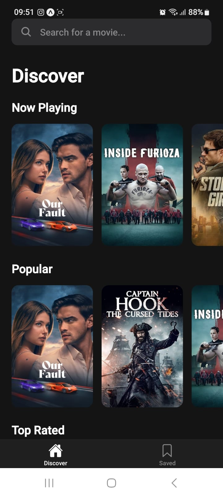
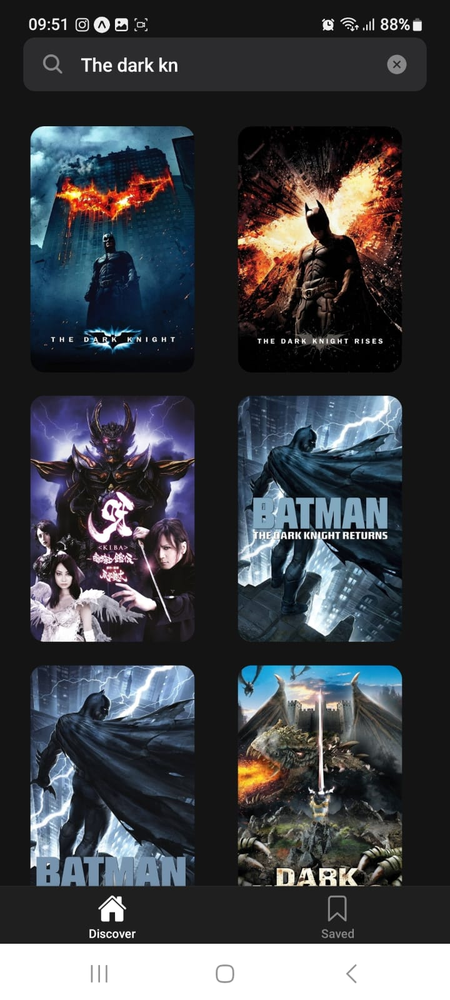
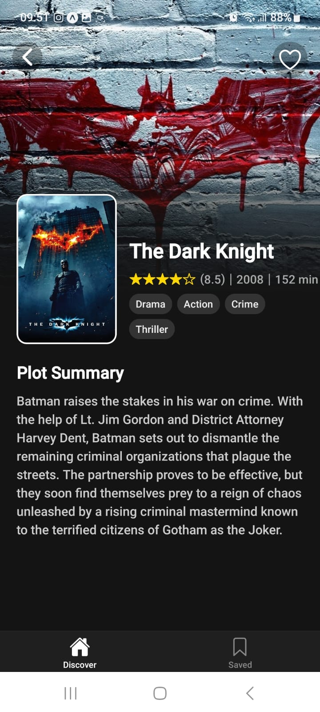
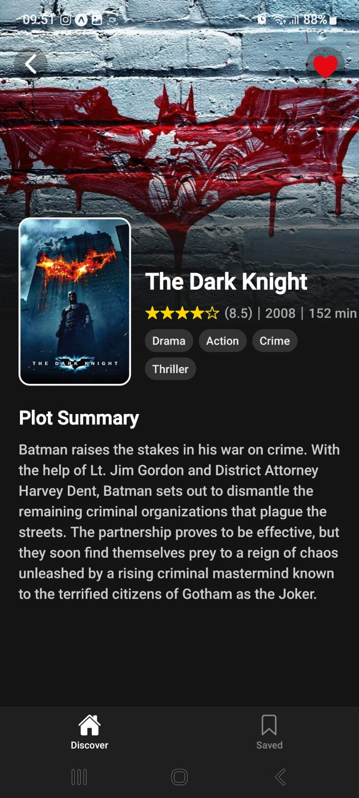
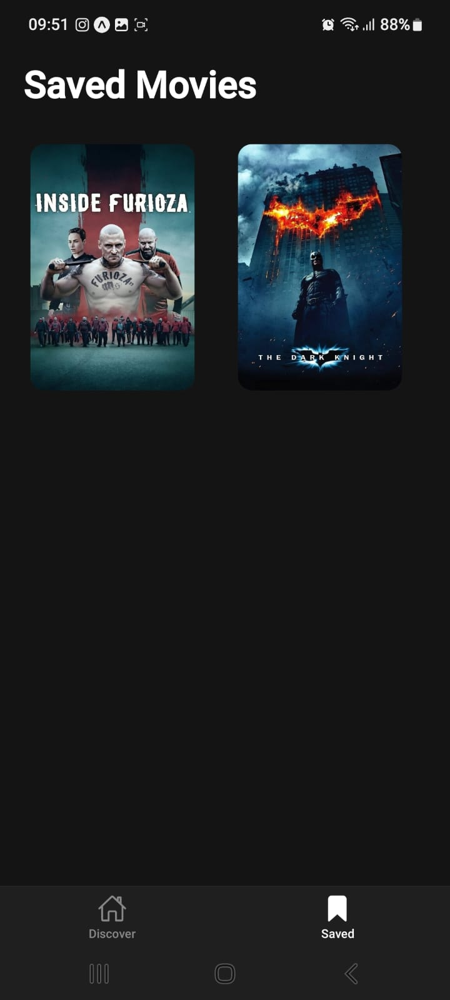

# 🎬 moviesRater - React Native Movie App

A sleek and modern React Native movie discovery application built with Expo. Users can browse, search, and save their favorite movies. The app features a dynamic tab-based navigation, a persistent favorites system, and fetches all data from The Movie Database (TMDB) API.

## ✨ Features

- **Movie Discovery**: Browse carousels of "Now Playing," "Popular," and "Top Rated" movies on the main screen.
- **Dynamic Search**: Instantly search for any movie with a debounced search bar that provides live results.
- **Detailed View**: Tap any movie to see a detailed screen with its backdrop, poster, rating, runtime, genres, and plot summary.
- **Favorites System**: Save movies to a persistent "Saved" list. The "like" button provides instant visual feedback.
- **Persistent Storage**: Saved movies are stored locally on the user's device using AsyncStorage and managed globally with React Context.
- **Tab Navigation**: A clean bottom tab navigator to switch between the "Discover" and "Saved" screens.

## 🎥 App Preview

<div align="center">
  
### Home Screen


### Search Functionality


### Movie Details


### Like/Unlike Feature


### Saved Movies


</div>

## 🛠 Tech Stack

- **Core**: React Native, Expo
- **Navigation**: React Navigation (Bottom Tabs & Native Stack)
- **State Management**: React Context API (for managing favorites)
- **Data Fetching**: Axios
- **API**: The Movie Database (TMDB)
- **Local Storage**: @react-native-async-storage/async-storage
- **UI Components**: expo-linear-gradient, @expo/vector-icons

## 🚀 Getting Started

### 1. Prerequisites

- Node.js (LTS version recommended)
- Expo Go app on your iOS or Android device (for development)
- expo-cli installed globally (or use npx)

### 2. Installation

Clone the repository and install the dependencies.

```bash
git clone https://github.com/codnizer/react_native_moviesRater.git
cd moviesRater
npm install
```
### 3. API Configuration

This project requires a v4 Access Token from The Movie Database (TMDB).

1. Sign up for a free TMDB account at [https://www.themoviedb.org/](https://www.themoviedb.org/)
2. Go to your account **Settings > API** and generate a new v4 Access Token
3. Open `api/tmdb.js` and paste your token into the `API_ACCESS_TOKEN` constant:

```javascript
// api/tmdb.js

// --- IMPORTANT ---
// Replace this with your v4 Access Token from TMDB
const API_ACCESS_TOKEN = 'YOUR_V4_ACCESS_TOKEN_GOES_HERE';
// -----------------
```
### 4. Running the App

Start the Expo development server:

```bash
npm start
```
Scan the QR code with the Expo Go app on your phone to launch the project.

### 5. Using .env for API Key

For better security, you can store your API key in an `.env` file.

1. Create a file named `.env` in the root of the project
2. Add your token with the `EXPO_PUBLIC_` prefix:

```env
EXPO_PUBLIC_TMDB_API_ACCESS_TOKEN=YOUR_V4_ACCESS_TOKEN_GOES_HERE
```

3. Add .env to your .gitignore file
4. Restart your server (npm start)
5. Update api/tmdb.js to use the environment variable:

```javascript
const API_ACCESS_TOKEN = process.env.EXPO_PUBLIC_TMDB_API_ACCESS_TOKEN;
```
### 6. Building for Production (APK)
To build a standalone .apk file for Android, this project uses EAS (Expo Application Services).

1. Install the EAS CLI
If you don't have it, install the global command-line tool:
```bash
npm install -g eas-cli
```
2. Log in to your Expo Account
```bash
eas login
```

3. Configure the Project
This command creates an eas.json file to configure your builds.

```bash
eas build:configure
```

4. Add Production Secrets (CRITICAL STEP) EAS builds in the cloud and cannot access your local .env file. You must provide your API key as a "secret." Run this command once:

```Bash
# Replace YOUR_TOKEN_HERE with your actual API token
eas secret:create --scope project --name EXPO_PUBLIC_TMDB_API_ACCESS_TOKEN --value "YOUR_TOKEN_HERE"
```

5. Configure Build Files (app.json & eas.json) You must tell the build to use your secret and request Internet permissions.

First, in app.json, add the android.permissions key:

```JSON

{
  "expo": {
    ...
    "android": {
      ...
      "permissions": [
        "android.permission.INTERNET"
      ]
    },
    ...
  }
}
```
Second, in eas.json, modify your production profile to build an APK and use the secret you created:

```JSON
{
  "cli": { ... },
  "build": {
    "production": {
      "android": {
        "buildType": "apk"
      },
      "env": {
        "EXPO_PUBLIC_TMDB_API_ACCESS_TOKEN": "@EXPO_PUBLIC_TMDB_API_ACCESS_TOKEN"
      }
    },
    ...
  },
  ...
}
```

6. Start the Build Run the build command for the production profile:
```Bash
eas build -p android --profile production
```

7. Download Your APK EAS will build your app in the cloud (this may take 5-15 minutes). When finished, it will provide a secure link. You can follow this link to download your .apk file.

### 📁 File Structure

Here is a simplified overview of the project structure:
```text
├── api/
│   └── tmdb.js           # All TMDB API calls and Axios setup
├── assets/               # App icons and splash screens
├── components/
│   ├── MovieCard.js      # Reusable card for movie posters
│   └── Rating.js         # Star rating component
├── context/
│   └── FavoritesContext.js # Global state for saved movies
├── navigation/
│   └── AppNavigator.js   # Main Tab and Stack navigators
├── screens/
│   ├── HomeScreen.js     # Discover and Search screen
│   ├── DetailScreen.js   # Movie details screen
│   └── SavedScreen.js    # Screen for favorited movies
└── App.js                # Root component with Navigation/Context providers
```